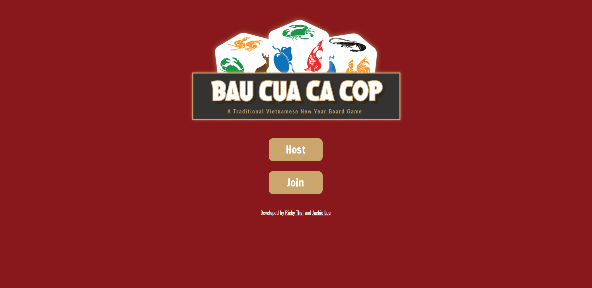
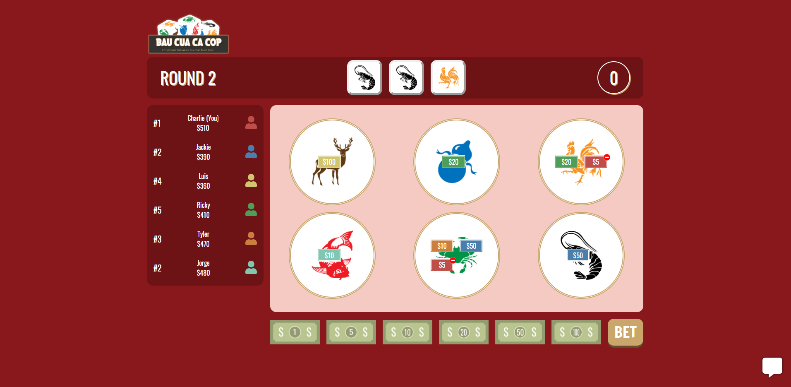

### Preview

## To start development

1. Clone the project.
2. Run `git submodule init` and `git submodule update` subsequently.
3. Run `npm install` and `npm run install-client` from the root directory.
4. Run `npm run dev` from the root directory.

The server will be listening on port 9000 by default.\
The client will be running on port 3000 by default.

Open http://localhost:3000 to view it in the browser.
